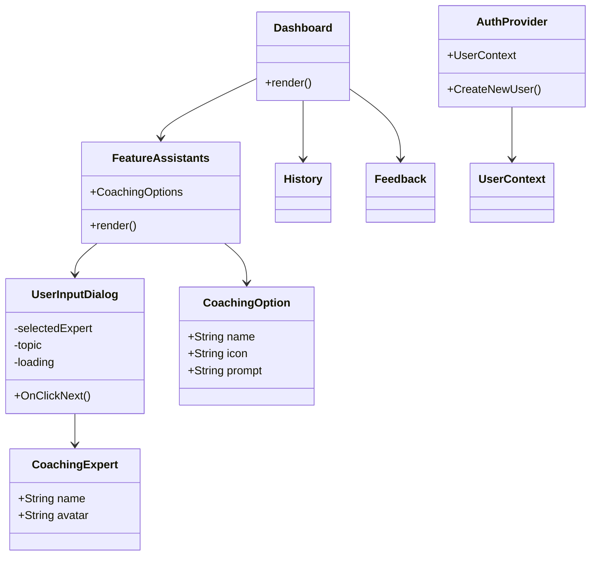
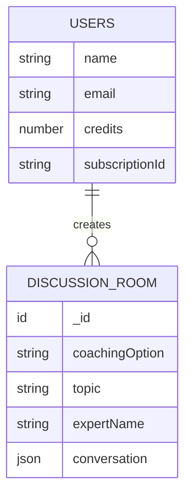
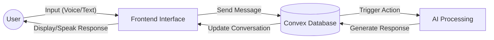
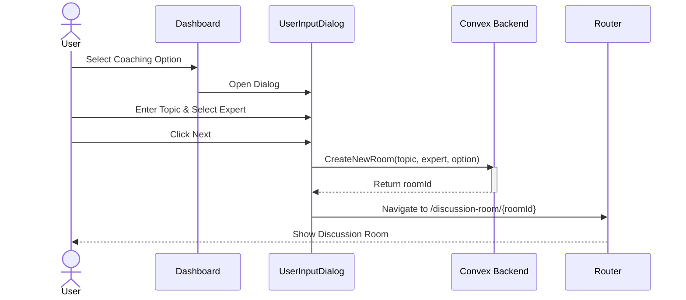
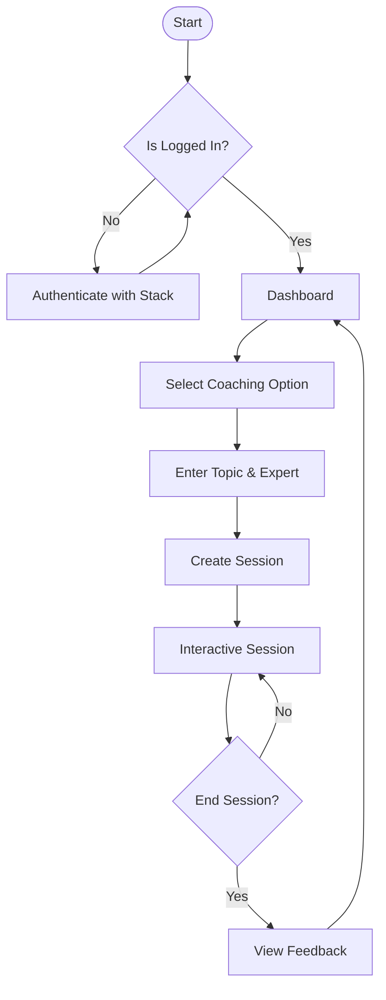

# Project Diagrams

This document contains the architectural and design diagrams for the **AI Coaching Voice Agent**.

> **Note**: These diagrams are written in [Mermaid](https://mermaid.js.org/) syntax. You can view them directly in VS Code if you have a Mermaid extension installed, or copy the code blocks into the [Mermaid Live Editor](https://mermaid.live/) to generate and download PNG images.

## 1. Use Case Diagram

Describes the user's interactions with the system.

```mermaid
usecaseDiagram
    actor User
    
    package "AI Coaching Voice Agent" {
        usecase "Login / Sign Up" as UC1
        usecase "View Dashboard" as UC2
        usecase "Select Coaching Option" as UC3
        usecase "Start Coaching Session" as UC4
        usecase "View History" as UC5
        usecase "View Feedback" as UC6
        usecase "Manage Profile" as UC7
    }

    User --> UC1
    User --> UC2
    User --> UC3
    User --> UC4
    User --> UC5
    User --> UC6
    User --> UC7

    UC3 --> (Lecture on Topic)
    UC3 --> (Mock Interview)
    UC3 --> (Ques Ans Prep)
    UC3 --> (Languages Skill)
    UC3 --> (Meditation)
```

## 2. System Architecture Diagram

High-level overview of the system components and their interactions.

```mermaid
graph TB
    subgraph Client ["Client Side (Next.js)"]
        UI[User Interface / React Components]
        AuthClient[Stack Auth Client]
        ConvexClient[Convex React Client]
    end

    subgraph Backend ["Backend Services"]
        Convex[Convex (Database & Edge Functions)]
        StackAuth[Stack Auth (Authentication)]
    end

    subgraph External ["External AI Services"]
        OpenAI[OpenAI API]
        AssemblyAI[AssemblyAI (Speech-to-Text)]
        Polly[AWS Polly (Text-to-Speech)]
    end

    UI --> AuthClient
    UI --> ConvexClient
    AuthClient --> StackAuth
    ConvexClient --> Convex
    Convex --> OpenAI
    Convex --> AssemblyAI
    Convex --> Polly
```

## 3. Class Diagram

Represents the structure of key React components and data objects.



## 4. ER Diagram (Entity Relationship)

Database schema defined in Convex.



## 5. Data Flow Diagram (DFD)

Flow of data through the system during a coaching session.



## 6. Sequence Diagram

The process flow for starting a new coaching session.



## 7. Flow Chart

User journey flow.



## 8. Deployment Diagram

Physical/Cloud deployment structure.

```mermaid
graph TB
    node ClientDevice [Client Device] {
        artifact Browser
    }

    node Cloud [Cloud Infrastructure] {
        node Vercel [Vercel Hosting] {
            artifact NextJS_App
        }
        
        node ConvexCloud [Convex Cloud] {
            database ConvexDB
            artifact EdgeFunctions
        }
        
        node StackCloud [Stack Auth Cloud] {
            artifact AuthServer
        }
    }

    Browser -- HTTPS --> NextJS_App
    Browser -- WSS/HTTPS --> ConvexCloud
    Browser -- HTTPS --> StackCloud
```
